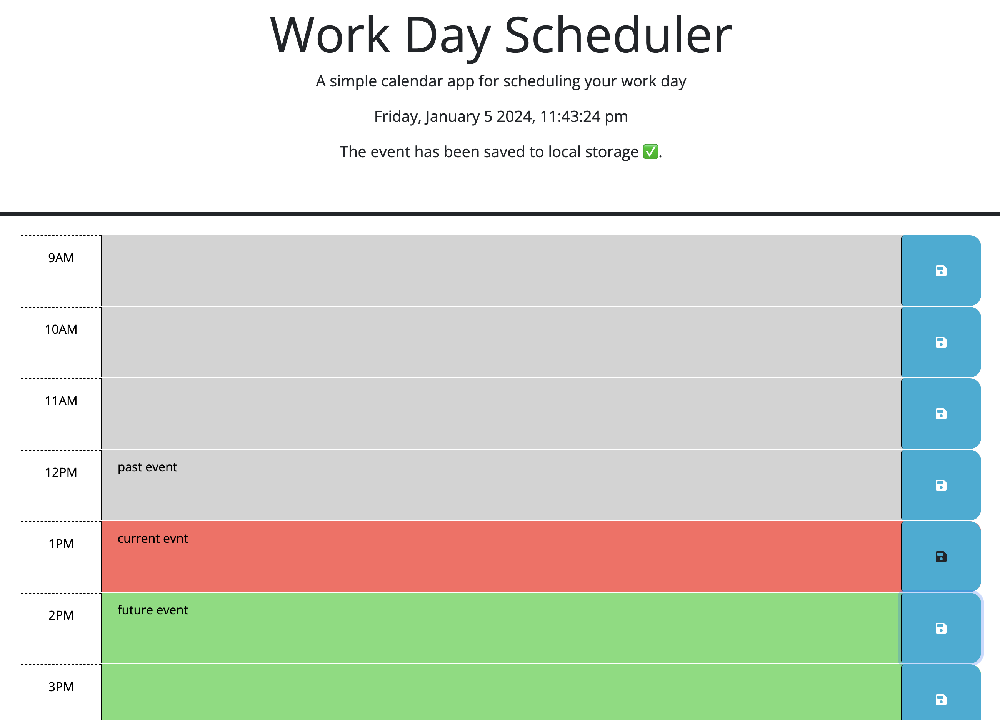

# Work Day Scheduler

## Description
    We all have busy work days and a little order is necessary. That's what this project was for. You can use it to plan your work day from 9am-5pm. The grey color are the events that has past, the red is the current event, and green is future events.

## Installations
No installation necessary, use the following URL to get to the scheduler. 
https://mikenguyen1092.github.io/05_Scheduler/

## Usage
    1. Put the event on the time you want it to be and click click the save button. 
    
    2. When you click the save button, a message will appear that it is saved to local storage. It will save for you even after you refresh the page.
    
    3. To change event, simply delete the old one and put a new one in.

## Credits
    Michael Nguyen

    EdX AI chat
    
## License
    MIT License

    Copyright (c) [2024] [Michael Nguyen]

    Permission is hereby granted, free of charge, to any person obtaining a copy of this software and associated documentation files (the "Software"), to deal in the Software without restriction, including without limitation the rights to use, copy, modify, merge, publish, distribute, sublicense, and/or sell copies of the Software, and to permit persons to whom the Software is furnished to do so, subject to the following conditions:

    The above copyright notice and this permission notice shall be included in all  copies or substantial portions of the Software.

    THE SOFTWARE IS PROVIDED "AS IS", WITHOUT WARRANTY OF ANY KIND, EXPRESS OR IMPLIED, INCLUDING BUT NOT LIMITED TO THE WARRANTIES OF MERCHANTABILITY, FITNESS FOR A PARTICULAR PURPOSE AND NONINFRINGEMENT. IN NO EVENT SHALL THE AUTHORS OR COPYRIGHT HOLDERS BE LIABLE FOR ANY CLAIM, DAMAGES OR OTHER LIABILITY, WHETHER IN AN ACTION OF CONTRACT, TORT OR OTHERWISE, ARISING FROM, OUT OF OR IN CONNECTION WITH THE SOFTWARE OR THE USE OR OTHER DEALINGS IN THE SOFTWARE.